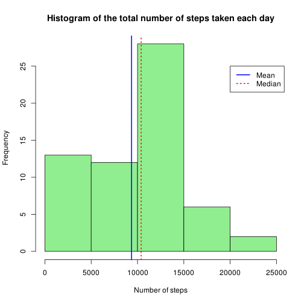
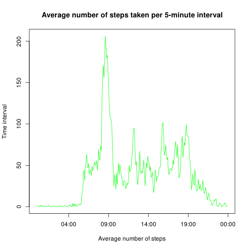
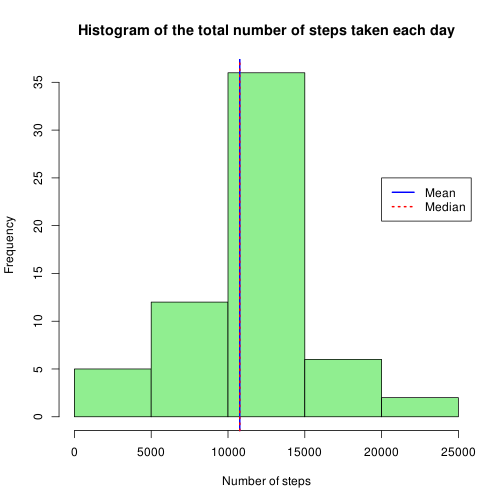
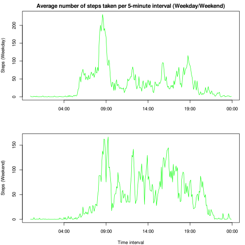

# Reproducible Research: Peer Assessment 1
Yolife Arvelo

## Objective
This report is intended to answer the first project for the Reproducible
Research class in Coursera.

The data came from a personal activity monitoring device, which collected data
at 5 minute intervals through out the day. The data consists of two months of data from an
anonymous individual collected during the months of October and November, 2012 and include the
number of steps taken in 5 minute intervals each day.

## Data
The data was obtained from: https://d396qusza40orc.cloudfront.net/repdata%2Fdata%2Factivity.zip


```r
if (!file.exists("activity.zip")){
        url <- "http://d396qusza40orc.cloudfront.net/repdata%2Fdata%2Factivity.zip"
        download.file(url, destfile = "./activity.zip")
}
unzip("./activity.zip")
filedate <- file.info("activity.csv")$mtime
```

To create this report the data was downloaded on: 2015-04-19 23:27:50

The variables included in the dataset are:

- `steps`: Number of steps taken in a 5-minute interval (missing values are coded as NA)

- `date`: The date on which the measurement was taken in YYYY-MM-DD format

- `interval`: Identifier for the 5-minute interval in which measurement was taken

## Loading and preprocessing the data
To start, the data was loaded into a dataframe to give it a first look.

```r
activitydata <- read.csv("activity.csv")
summary(activitydata)
```

```
##      steps                date          interval     
##  Min.   :  0.00   2012-10-01:  288   Min.   :   0.0  
##  1st Qu.:  0.00   2012-10-02:  288   1st Qu.: 588.8  
##  Median :  0.00   2012-10-03:  288   Median :1177.5  
##  Mean   : 37.38   2012-10-04:  288   Mean   :1177.5  
##  3rd Qu.: 12.00   2012-10-05:  288   3rd Qu.:1766.2  
##  Max.   :806.00   2012-10-06:  288   Max.   :2355.0  
##  NA's   :2304     (Other)   :15840
```

```r
head(activitydata)
```

```
##   steps       date interval
## 1    NA 2012-10-01        0
## 2    NA 2012-10-01        5
## 3    NA 2012-10-01       10
## 4    NA 2012-10-01       15
## 5    NA 2012-10-01       20
## 6    NA 2012-10-01       25
```

New fields (date,time) were created to store the date and time of the observation, as POSIXct variables. Notice that even tough it would be possible to have date and time in the same variable, the fields were kept separate for the purpose of the questions that would be answered.


```r
library(stringr)
activitydata$date <- as.POSIXct(activitydata$date, tz = "GMT", format="%Y-%m-%d")
activitydata$time <- as.POSIXct(str_pad(activitydata$interval, 4, pad="0"), tz = "GMT", format="%H%M")
head(activitydata)
```

```
##   steps       date interval                time
## 1    NA 2012-10-01        0 2015-04-19 00:00:00
## 2    NA 2012-10-01        5 2015-04-19 00:05:00
## 3    NA 2012-10-01       10 2015-04-19 00:10:00
## 4    NA 2012-10-01       15 2015-04-19 00:15:00
## 5    NA 2012-10-01       20 2015-04-19 00:20:00
## 6    NA 2012-10-01       25 2015-04-19 00:25:00
```

## What is the mean total number of steps taken per day?

A summarized dataset was created to calculate the total steps per day using dplyr (NA values were ignored). The histogram plot below shows the frequency of the total steps variable (the mean and median were plotted as vertical lines).

```r
library(dplyr)
summaryPerDay <- summarise(group_by(activitydata,date), total=sum(steps,na.rm=TRUE))
mean=mean(summaryPerDay$total,na.rm=TRUE)
median=median(summaryPerDay$total,na.rm=TRUE)
hist(summaryPerDay$total, main="Histogram of the total number of steps taken each day", col="lightgreen", xlab="Number of steps")
abline(v=mean, col="blue", lwd=2)
abline(v=median, col="red", lwd=2, lty=3)
legend(20000,25, c("Mean", "Median"), col=c("blue","red"), lwd=2, lty=c(1,3))
```

 

The mean and the median are different in this case (9354 and 10395 steps respectively).


## What is the average daily activity pattern?
To answer this question, another summarized dataset was created to calculate the average number of
steps taken for every 5-minute interval. The average was taken across all days. A time series plot is shown below.

```r
summaryPerInterval <- summarise(group_by(activitydata, time, interval), average=mean(steps,na.rm=TRUE))
max=max(summaryPerInterval$average, na.rm=TRUE)
maxInterval=format(filter(summaryPerInterval,average==max)$time,"%H:%M")
plot(summaryPerInterval$time, summaryPerInterval$average, main="Average number of steps taken per 5-minute interval", type = "l",  col="green", xlab="Average number of steps", ylab="Time interval")
```

 

The interval that contains the maximun number of steps is 08:35 with 206 steps on average across all days.

## Imputing missing values
The original data frame has 2304 missing values. The presence of missing days may introduce bias into some calculations or summaries of the data.

To check if bias was introduced when removing the missing values, all NA values were replaced using
the average of the corresponding 5-minute interval.

```r
missingValues <- function(s,i,summarydf=summaryPerInterval)
{ return(ifelse(is.na(s), filter(summarydf, interval==i)$average, s)) }
actdatacomplete <- activitydata
actdatacomplete$steps <- mapply(missingValues, activitydata$steps, activitydata$interval)
```

A histogram for the new data frame (with the imputed values) and the mean and median were calculated again and the results are very different than before.

```r
summaryPerDayComp <- summarise(group_by(actdatacomplete,date), total=sum(steps))
mean=mean(summaryPerDayComp$total)
median=median(summaryPerDayComp$total)
hist(summaryPerDayComp$total, main="Histogram of the total number of steps taken each day", col="lightgreen", xlab="Number of steps")
abline(v=mean, col="blue", lwd=2)
abline(v=median, col="red", lwd=2, lty=3)
legend(20000,25, c("Mean", "Median"), col=c("blue","red"), lwd=2, lty=c(1,3))
```

 

The mean and median now have the same value (10766 steps). The result indicates that ignoring NA values introduced bias to the initial analysis.

## Are there differences in activity patterns between weekdays and weekends?
To answer this question, a new factor variable `weekday` was created with 2 levels: "weekday" and "weekend" indicating whether a given date is a weekday or weekend day. The data frame with the filled-in missing values was used for this question.


```r
actdatacomplete$weekday <- as.factor(ifelse(grepl("Sunday|Saturday", weekdays(actdatacomplete$date)),"Weekend", "Weekday"))
```

The panel plot below shows the average number of steps taken for each 5-minutes interval across all days (weekday or weekend)

```r
summaryPerIntervalWeekday <- summarise(group_by(actdatacomplete, weekday, time), average=mean(steps))

weekdayData = filter(summaryPerIntervalWeekday, weekday=="Weekday")
weekendData = filter(summaryPerIntervalWeekday, weekday=="Weekend")
par(mfrow=c(2,1),mar = c(4, 4, 2, 1), cex=0.8)

plot(weekdayData$time, weekdayData$average, main="Average number of steps taken per 5-minute interval (Weekday/Weekend)", type = "l",  col="green", xlab="", ylab="Steps (Weekday)")
plot(weekendData$time, weekendData$average, main="", type = "l",  col="green", xlab="Time interval", ylab="Steps (Weekend)")
```

```
## Warning in min(x): no non-missing arguments to min; returning Inf
```

```
## Warning in max(x): no non-missing arguments to max; returning -Inf
```

```
## Warning in min(x): no non-missing arguments to min; returning Inf
```

```
## Warning in max(x): no non-missing arguments to max; returning -Inf
```

```
## Error in plot.window(...): need finite 'xlim' values
```

 

From the plot above, it's possible to conclude that the person was more active during the weekends than during weekdays.
